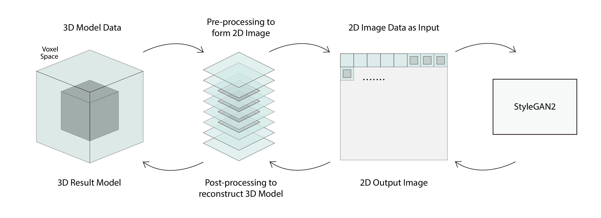
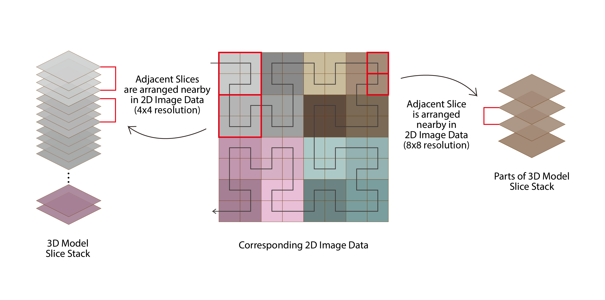
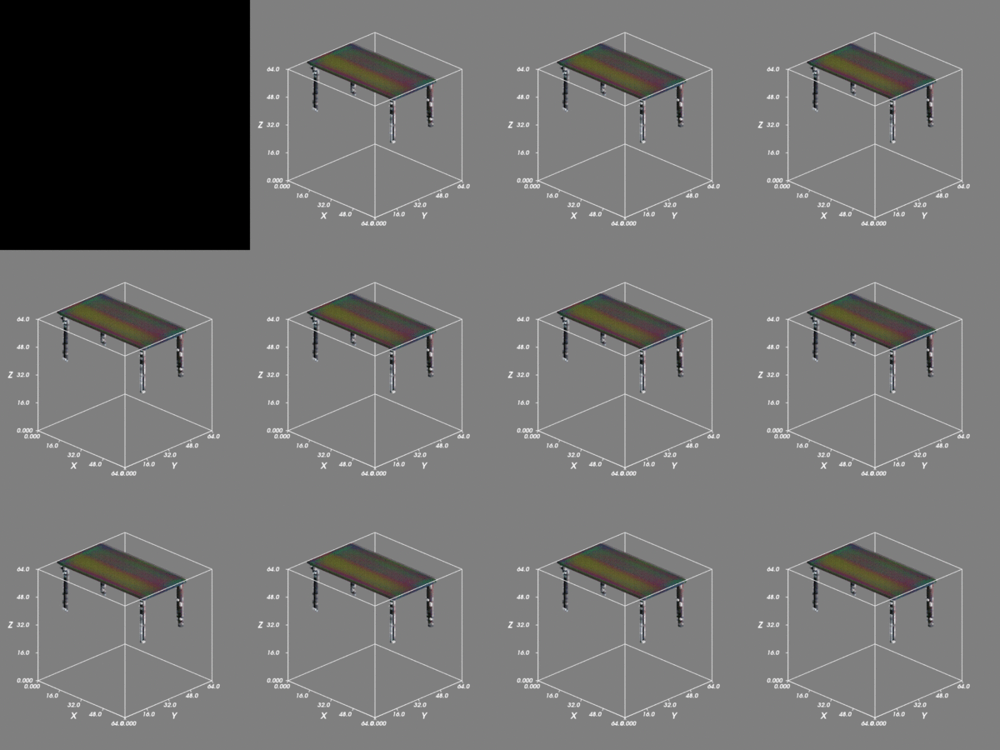

# A Quick Glance

Jo add discription

|       Approach        | 2D images           | its 3D representation |
| :---------------------|:-------------------:| :--------------------:|
| Flatten approach      | image               | image                 |
| Texture approach      | image               | image                 |
| Slice approach        | image               | image                 |

# Beginning
Since StyleGAN requires all the input image must be square image and its length of side must be the power of 2 (1024, 512, 256, ...).  
At the beginning of our project, we just simply flatten the 3D space into 2D images. At that time, we just test whether StyleGAN could recognize this transformation so the input data is monochrome.  
In our approach, we set a cutoff for determining whether the voxel exists. For monochrome image, we set the cutoff to be 128, which means only if all the rgb value are lower than 128, then the voxel exists. For the chromatic image, the cutoff would be set to be 192. This would be explained in detail later (color approach).

## Flatten approach
1. Enlarge the 3D model by 3 along x,y,z axis (30, 30, 30, 3) -> (90, 90, 90, 3)
2. Flatten the 3D array (90, 90, 90, 3) -> (729000, 3)
3. In order to reshape the array into 2D image, which its size is 1024*1024, but the flatten array is only (729000, 3), so concatenate size of (319576, 3) white pixel [255, 255, 255] to the flatten array and make it to be (729000 + 319576, 3) -> (1048576, 3) -> (1024, 1024, 3)

This is how the input data created. 

## Result
add result

The result is not satisfying. Only proved that a cuboid-like model can be learned by StyleGAN.

# Improvement

Since we want to increase the fault tolerance, single line or pixel in the 2D image should be avoided. Therefore, new approach is implemented.

## New flatten approach

1. Flatten the 3D array (30, 30, 30, 3) -> (27000, 3)
2. Concatenate size of (38536, 3) white pixel to flatten array (27000 + 38536, 3) -> (65536, 3)
3. Reshape the array to be 2D image with size 256 * 256 (65536, 3) -> (256, 256, 3)
4. Scale the image along width and height by 4. (256, 256, 3) -> (1024, 1024, 3)

## Assumption behind

1. Each voxel now is represented as a 4 * 4 area of pixel, even if some pixel go wrong, the result could still be satisfying since interpolation was applied to calculate the average rgb value of the voxel
2. This approach is conducive to recognize the image. As the convolution network is full of 3 * 3 filter, the rgb value in all the possible 3 * 3 grid would not change rapidly.

## Result

add result

Most of the results are satisfying. However some results need to be re-train several times to make it to be acceptable. We guess the network sometimes still rely on some random varibles, especially when the input dataset is mixed with different axis and color.

# StyleGAN2 launched
According to [StyleGAN2 repository](https://github.com/NVlabs/stylegan2), StyleGAN2 had been revisited different features, including progressive growing, removing normalization artifacts, etc. As the result, This revised StyleGAN benefits our 3D model training. The incoming results were trained by StyleGAN2.  

Since we had proved that StyleGAN2 copntains the ability to recongnizing color and shape in our approach. We further extend the possible 3D space from (30, 30, 30, 3) to (64, 64, 64 ,3) and it can be reshaped as a 512 * 512 image, noted that 64 * 64 * 64 = 512 * 512. Therefore, no more white pixel need to be added into the flatten array. All the pixel in 2D image could be fully utilized.

# Flatten approach in StyleGAN2
This time we would 512 * 512 image as our shape of input images becausae it helps reduce the training time. Surprisingly, the network still recognize the input dataset but just only for the input dataset contains less variations.

## Approach
1. Flatten the 3D array (64, 64, 64, 3) -> (262144, 3)
2. Reshape the array to be 2D image with size 512 * 512 (262144, 3) -> (512, 512, 3)

## results (bookcase)
add result  
add discription

## results (table)
add result  
add discription  

On the other hand, we were developing texture approach meanwhile.
# Texture approach
In this approach, we choose texture as our input dataset. We choose  Minecraft human texture as our input dataset since it is relatively low resolution and contains tons of resources on the Internet thanks to the community.

## results 
add result  
add discription  

# Slice approach
As we want to take the advantages of powerful recognizing 2D images ability in StyleGAN2. We choose to revise the representation of 3D model.

## Approach
1. Slice the 3D model along x/y/z axis. Slicing along which axis depends on the input dataset. (64, 64, 64, 3) -> (64, 64, 3, 64)
2. Paste those sliced images to a 512 * 512 image. (64, 64, 3, 64) -> (512, 512, 3)

## Asumption behind
1. If those 2D images which converted from 3D models, they share more similiar area by slicing along one specific axis, then that axis would be more appropriate as our choice since this is good for the network to recognize our input dataset.

## results 
add result  
add discription  

# Improvement of slice approach

  
Source: [StyleGAN2 paper](https://arxiv.org/pdf/1912.04958.pdf)  

From the network structure, we can find that the synthesis network make a image from low resolution to high resolution. If we could arrange the slice in this approach:  
  
Source: [DateGenetics](http://datagenetics.com/blog/march22013/)
Then the relationship of the slice could be strengthened and this helps synthesis process.  

4 x 4 :  

At least in every 4 or 8 adjacent slice could be segmented as the same 8 x 8 or 4 x 4 grid respectively. We assume that it is good for the network, especially increasing the ability of style-mixing.

## Slice approach with Hilbert's curve

add discription  

### results 
add result  
add discription  

## Slice approach with 3 dimension
add discription  

### results 
add result   
Suprisingly, the training time has reduced after using this approach and it is quite hard to prove that the style-mixing ability has been increased. We would try to measure this in the update version.

# More results of slice approach with Hilbert's curve

## 3D texture
add result  

## table
add result  

## chair
add result  

add discription 
